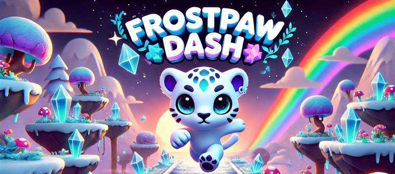

# **Frostpaw Dash**  

  

## **Overview**  
**Frostpaw Dash** is an endless runner 3D game inspired by *Temple Run*, developed in **Unity Engine 6**. Players take control of a **chibi snow leopard**, dashing through a stylized fantasy world filled with obstacles, environmental interactions, and dynamic challenges. The game features vibrant environments, smooth controls, and an immersive experience designed for endless fun.  

## **🌟 The Story of Frostpaw Dash**  
**Deep in the heart of the Frostveil Realm, a mystical land where magic flows through the air like drifting snowflakes, a young chibi snow leopard named Frostpaw embarks on an endless run.**  

Legends speak of the **Celestial Nexus**, an ancient artifact hidden within the forgotten ruins of time. It is said to hold the power to **restore balance** to the realm, but reaching it requires crossing treacherous landscapes filled with **crumbling paths, shifting bridges, and enchanted guardians** determined to keep its secrets hidden.  

One fateful night, the **Northern Lights pulse with an unknown energy**, awakening an ancient force deep beneath the Crystal Caverns. The ground trembles, the once-frozen paths begin to collapse, and glowing rune gates flicker open, revealing the way forward.  

With no time to waste, **Frostpaw dashes into the unknown**, dodging enchanted obstacles, navigating through mystical realms, and racing against time to uncover the truth behind the Celestial Nexus. The journey will test speed, agility, and courage—but Frostpaw must keep running… because something **dark and unseen** stirs in the shadows, ready to chase.  

---

## **Game Features**  
- 🎮 **Infinite Runner Mechanics** – Procedurally generated levels for endless replayability.  
- 🏃 **Smooth & Responsive Controls** – Swipe or tilt-based movement for intuitive gameplay.  
- ⚠️ **Dynamic Environmental Interactions** – Moving platforms, falling obstacles, and shifting pathways.  
- 🌌 **Seasonal & Themed Content Updates** – Environments change based on real-world seasons. (coming soon)
- 🏆 **High Score & Leaderboards** – Compete with past runs and submit scores!  
- 🎨 **Stylized Fantasy Aesthetic** – Beautifully crafted environments with an anime-inspired look.  
- 🐆 **Chibi Rainbow Snow Leopard Character** – Fully animated and rigged for fluid movement.  

---

## **🚀 Latest Updates (v1.4.02) – March 22, 2025**  
🎉 **Finalized Easter Biome Playtest Build! Character Fixes, Prefab Spawning, and Load Speed Optimizations!**

### 🆕 **New Features & Improvements**

✅ **EasterBunny Character Finalized** 🐰  
- Fixed movement, gravity, and jump logic  
- Root motion disabled for proper controller-based physics  
- New animations properly rigged and synced  

✅ **Obstacle & Prefab Spawner Logic Overhaul**  
- Weighted spawn logic for obstacles (elements 0–3 now spawn more frequently)  
- EasterEggsNest and LogsSpring now spawn correctly on top of the floor  
- CarrotCake prefab prevents the floor from spawning underneath it  
- Prefabs now retain their original Y-position and rotation  

✅ **Async Scene Loading in Main Menu** ⚡  
- Play button now loads scenes using `SceneManager.LoadSceneAsync()`  
- Fast load times on Google Pixel 6a (down from 15–20s to ~3s)  

✅ **New Easter Loading Screen Background**  
- Fantasy-styled vertical background with glowing eggs, chocolate terrain, and pastel skies  
- No UI or text—perfect for fullscreen scene transitions  

✅ **Bug Fixes & Polish**  
- Fixed overlap issues on collectible and obstacle spawns  
- Cleaned up destroyed prefab references to avoid NullReferenceExceptions  
- UI buttons and scene transitions tested for Android  

---

## **Environments & Difficulty Progression**  
Each environment introduces unique **obstacles and mechanics** while maintaining balanced gameplay:  

### 🌟 **Level 1: Crystal Caverns (Beginner-Friendly)**  
- 🌌 **Obstacles:** Falling stalactites, crystal bridges, and icy platforms.  
- 🔹 **Mechanics:** Slow-moving hazards, simple jumps, and minimal speed increase.  

### 🐣 **Seasonal Biome: EasterLevel (Now Playable)**  
- 🍫 **Obstacles:** CarrotCake (floor replacement), LogsSpring, EasterEggsNest  
- 🌈 **Mechanics:** Gaps between floors, floating collectibles, dynamic bridge rate  
- 🎵 **Theme:** Candy pastel landscape, glowing moon, springtime vibe  

---

## **Development Roadmap**  

### ✅ **Current Progress**  
- ✅ Easter biome is now fully playable  
- ✅ EasterBunny character finalized  
- ✅ All prefab logic fixed and tested  
- ✅ Optimized loading system for Android  
- ✅ Async scene loading implemented  

### 📉 **Next Steps**  
- [ ] Collect playtest feedback from friends/family  
- [ ] Refine collectible and gap difficulty balance  
- [ ] Begin design of **Level 2: Celestial Ruins**  (possible new character or existing one haven't decided yet)
- [ ] Add more polish to bridge FX and obstacle animations  

---

### **How to Run & Install the APK on Android Devices**

You can test Frostpaw Dash on Android even though it's not on the Google Play Store yet. Here's how to get started:

### ✅ 1. Download the APK
Visit the [Releases](https://github.com/phoenixgoldz/FrostpawDash/releases) section and download the latest `.apk` file:  
**`FrostpawDash_V1-4-02.apk`**

---

### ✅ 2. Transfer the APK to Your Device
Choose one of these options:
- **USB Cable** – Copy the APK to your Downloads folder on the device.
- **Cloud Upload** – Use Google Drive or Dropbox to upload and download the APK.
- **Email or Chat** – Send the file to yourself via email or a messaging app.

---

### ✅ 3. Enable "Install Unknown Apps" on Android
On your Android phone or tablet:
- Go to **Settings > Security** (or **Settings > Apps & Notifications > Special App Access** on newer Android versions)
- Tap **Install unknown apps**
- Choose the app you'll use to open the APK (e.g., Chrome, Files, Drive)
- Tap **Allow from this source**

---

### ✅ 4. Install and Run the Game
- Open the `.apk` file from your file manager or Downloads folder
- Tap **Install**
- Once installed, tap **Open** to start playing Frostpaw Dash!

---

*If you run into any issues, make sure your APK was fully downloaded and that you've enabled install permissions for your app source.*

## **License**  
MIT License  
